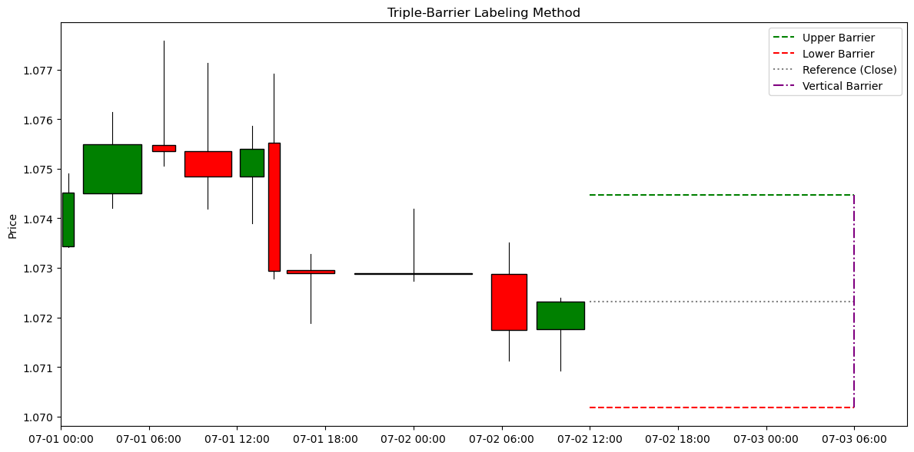
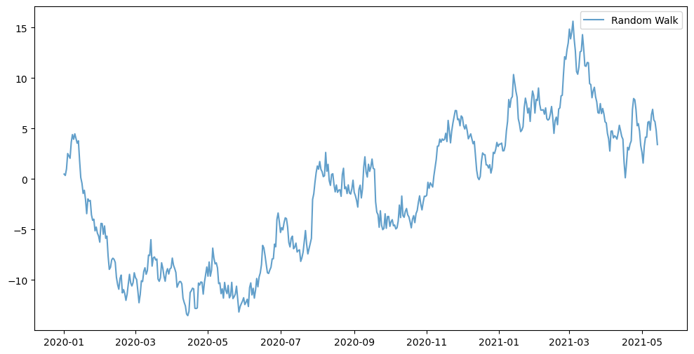
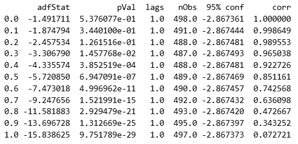
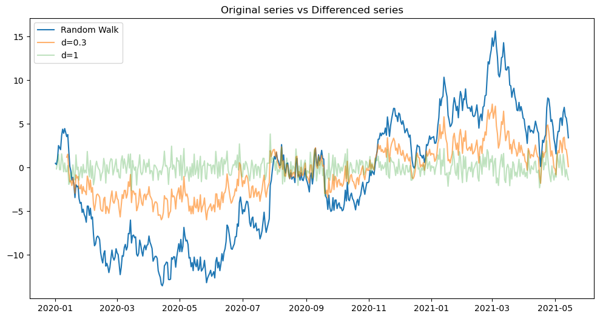

## Financial Data Labeling and Preprocessing FrameworkIntroduction

This repository implements a complete pipeline for quantitative finance research.
Starting from a dataset composed of time bars (candlestick data), the code applies the triple-barrier method for event labeling and enriches the dataset with lagged features.

In addition, the pipeline integrates Sequential Bootstrap as a resampling method, and Purged K-Fold Cross-Validation as a validation scheme. These techniques ensure a statistically sound dataset split that accounts for the overlapping nature of financial time series.

The final output is a machine learning dataset that can be directly used to train predictive models for financial forecasting and strategy evaluation.

## Theoretical Background

This project is built on concepts from "Advances in Financial Machine Learning" by Marcos Lopez de Prado, aiming to create reliable labels and features for predictive modeling. Below is an overview of the theory behind each step of the pipeline.

### Bars

Bars provide a structured way to organize market information. Typically, each bar contains the open, close, low, and high prices, together with a timestamp and, in many cases, the traded volume. They serve as the fundamental building blocks from which higher-level features and labels are derived.

#### Time bars

Time bars represent the most traditional approach to structuring financial data, where each bar (candlestick) corresponds to a fixed time interval (e.g., one minute, one hour, one day). They are intuitive and easy to interpret, as time is a natural reference aligned with how humans perceive events.

However, this method disregards the varying intensity of market activity. A bar constructed during a highly active period (e.g., a news release) contains the same informational "weight" as a bar constructed during a period of inactivity, which may introduce inefficiencies in subsequent analyses.

#### Volume bars

In contrast to time bars, volume bars are constructed when a predefined quantity of traded volume has been accumulated. For example, if the bar size is set to 1,000 units, a new bar is created each time 1,000 units of the asset are exchanged, irrespective of the time elapsed.

The principal advantage of volume bars lies in their adaptability: during periods of high trading activity, more bars are generated, while fewer bars are created during quiet periods. This ensures that the data representation is more closely aligned with actual market activity, thereby improving the statistical properties of the sample.

#### Dollar bars

Dollar bars extend the concept of volume bars by constructing bars once a predefined amount of traded dollar value has been reached. For instance, if the bar size is set to $1,000,000, a new bar is generated each time transactions accumulate to this monetary threshold, regardless of the number of units traded or the time elapsed.

This approach incorporates both trading activity and the prevailing price level of the asset. As a result, each bar represents a consistent monetary impact, making dollar bars particularly advantageous when comparing assets with heterogeneous price ranges, or when focusing on the financial significance of trades rather than their sheer volume.

Although there exist additional methodologies for structuring market data—such as non-negative series or tick bars—this research will initially focus on time bars and volume/dollar bars. These approaches are considered the most suitable for the type of projects undertaken in this work, as they provide a balance between interpretability and statistical robustness.

### Sampling

So far, we have obtained a more informative dataset to initiate the training of machine learning models. However, an important consideration must be addressed: if the objective is to build a model capable of predicting financial outcomes, it is crucial that the algorithm learns primarily from relevant examples. Attempting to generate predictions at every single timestamp would unnecessarily increase complexity and noise, making the learning process significantly more difficult. For this reason, it is preferable to detect and focus on  specific events, which serve as meaningful points for the model to learn from.

There exist multiple methodologies to reduce the number of observations in a financial time series. While several approaches will be explored in future stages of this research, the present work focuses on the implementation of the CUSUM Filter as an event detection mechanism.

#### CUSUM Filter

The CUSUM (Cumulative Sum) filter is a statistical quality-control technique designed to detect shifts in the mean of a measured process. Its goal is to identify significant deviations from a reference value by accumulating small changes over time.

Let us consider a sequence of independent and identically distributed (i.i.d.) observations $\{y_t\}_{t=1}^T$ from a locally stationary process. The cumulative sums are defined as:

$$
S_t = \max \{0, \, S_{t-1} + y_t - \mathbb{E}_{t-1}[y_t]\}, \quad S_0 = 0
$$

An action is triggered the first time $S_t$ exceeds a given threshold $h$ (the filter size).
Notice that $S_t = 0$ whenever $y_t \leq \mathbb{E}_{t-1}[y_t] - S_{t-1}$. This "zero floor" ensures that negative deviations do not accumulate indefinitely, as the filter is specifically designed to capture upside divergences.

Formally, the threshold condition can be written as:

$$
S_t \geq h \quad \Leftrightarrow \quad \exists \, \tau \in [1, t] :
\sum_{i=\tau}^t \big(y_i - \mathbb{E}_{i-1}[y_t]\big) \geq h
$$

This framework of run-ups can be extended symmetrically to detect run-downs as well, leading to the symmetric CUSUM filter:

$$
S_t^+ = \max \{0, \, S_{t-1}^+ + y_t - \mathbb{E}_{t-1}[y_t]\}, \quad S_0^+ = 0
$$

$$
S_t^- = \min \{0, \, S_{t-1}^- + y_t - \mathbb{E}_{t-1}[y_t]\}, \quad S_0^- = 0
$$

$$
S_t = \max \{S_t^+, -S_t^-\}
$$

In this symmetric version, the filter captures both upward and downward shifts in the process, making it well-suited for financial applications such as event detection in price series.

A bar at time $t$ will be sampled if and only if $S_t \geq h$, at which point the cumulative sum $S_t$ is reset. For simplicity, we assume that $\mathbb{E}_i[y_t] = 0, \ \ \forall \ i,t$, i.e., the process has zero conditional mean at all times.

### Labeling

So far, the feature set has been constructed, but the dataset remains incomplete without appropriate labels. To address this, the Triple-Barrier Labeling Method is employed, which provides a systematic framework for generating classification labels tailored to financial time series. This method is particularly well-suited for training machine learning classifiers, as it incorporates both price movements and time constraints into the labeling process.

#### Triple-Barrier Labeling Method

The Triple-Barrier Method provides a systematic framework for labeling financial time series in classification problems. Unlike traditional approaches that rely solely on fixed time horizons or thresholds, this method accounts for both price movements and time, producing more robust and economically meaningful labels.

The procedure defines three barriers for each observation in the time series:

1. Upper barrier (profit-taking level): If the asset’s price reaches this threshold before the others, the event is labeled as a positive outcome (+1).
2. Lower barrier (stop-loss level): If the price hits this threshold first, the event is labeled as a negative outcome (–1).
3. Vertical barrier (time limit): If neither the upper nor the lower barrier is reached within the predetermined time horizon, the outcome is determined by the return observed at the expiration of that horizon. In such cases, the label is set to 1 if the return is positive and -1 if the return is negative. Some approaches instead assign a label of 0 to these situations; however, doing so can introduce problems related to class imbalance and may reduce the informational content of the dataset.

This approach ensures that each event is classified in a way that incorporates both directional price moves and  time constraints, which are fundamental aspects of trading decisions. As a result, the triple-barrier method avoids biases introduced by arbitrary time-based labels and better reflects the dynamics of real financial markets.

This example illustrates the implementation of the triple-barrier method in a real trading position. In this case, the position is defined with parameters [1, 1], meaning that the profit-taking and stop-loss thresholds are symmetric. When the closing price reaches either of these two barriers, the outcome is labeled as 1 in the case of profit-taking or -1 in the case of stop-loss. Note that the width of the bars is irregular, as they correspond to volume bars.

### Sequential Bootstrap

Our features are not independent, since new events may begin before previous ones have ended. This violates the IID (independent and identically distributed) assumption required by most machine learning models.

To mitigate this issue, we employ  **sequential bootstrap** , a resampling technique that adjusts the probability of selecting observations according to their  *uniqueness* . This reduces redundancy from overlapping outcomes, producing samples that are closer to the IID assumption compared to the standard bootstrap. Importantly, each sample is defined not only from the occurrence of the event until the barrier is reached, but also incorporates the *n* historical bars preceding the event, thereby ensuring that relevant pre-event information is preserved.

The process works as follows:

1. Initial draw:The first observation is drawn uniformly:

   $$
   i \sim U[1, I], \quad \delta_i^{(1)} = \frac{1}{I}
   $$
2. Uniqueness of observation $j$ at time **$t$**:

   $$
   u_{t,j} = \frac{1_{t,j}}{1 + \sum_{k \in \varphi^{(t-1)}} 1_{t,k}}
   $$

   where $\varphi^{(t-1)}$ is the set of previously drawn observations, and $1_{t,j}$ indicates if $j$ is active at $t$.
3. Average uniqueness of $j$ over its lifespan:

   $$
   \bar{u}_j^{(t)} = \frac{\sum_{t=1}^T u_{t,j}}{\sum_{t=1}^T 1_{t,j}}
   $$
4. Updated sampling probability:

   $$
   \delta_j^{(t)} = \frac{\bar{u}_j^{(t)}}{\sum_{k=1}^I \bar{u}_k^{(t)}}, \quad \sum_{j=1}^I \delta_j^{(t)} = 1
   $$

The process continues until $I$ draws are made.
This approach allows for repeated draws (as in standard bootstrap), but the likelihood decreases with redundancy. As a result, the sequential bootstrap produces samples with higher average uniqueness and closer to independence than the standard bootstrap.

### Purged K-Fold CV

In financial time series, a conventional cross-validation approach cannot be applied directly. The main issue is the temporal dependence between observations: information from the training set can leak into the test set if events are not handled properly, which results in overly optimistic performance estimates.

To address this, Purged K-Fold Cross-Validation introduces two mechanisms:

1. Purging: When defining the training and test splits, all training samples whose labels overlap in time with the test set are removed. This prevents leakage of information from events that are still “active” during the test period.
2. Embargo: Even after purging, events occurring immediately after the test set may still share information with it due to the **serial correlation** of financial data. To mitigate this, a small embargo period is imposed after each test set, during which no training samples are allowed.

Moreover, each sample is defined not only from the occurrence of the event until the barrier is reached, but also includes the *n* historical bars preceding the event.

This methodology ensures that the validation process respects the chronological order of events and avoids look-ahead bias, producing more reliable performance estimates in financial applications.

### Fractional differentiation

Most statistical models rely on the assumption that the underlying process is stationary. A common approach to achieve stationarity is differencing. However, this transformation often produces a time series that exhibits very low serial correlation with the original one. As a result, although stationarity is attained, a substantial amount of memory is lost, which undermines predictive performance in most practical applications.

To address this limitation, fractional differentiation can be applied, allowing the differencing order $d$ to take non-integer values. By selecting an optimal $d$—defined as the smallest value of d for which the null hypothesis of a unit root in the Augmented Dickey-Fuller (ADF) test can be rejected—one can achieve stationarity while preserving a significant degree of memory from the original series.

Fractional differentiation generalizes the classical differencing used in time series analysis. Instead of requiring the differencing order $d$ to be an integer, it allows $d$ to take real values.

The backshift operator $B$ is defined as:

$$
B^k X_t = X_{t-k}
$$

With integer $d$, the differencing operator is:

$$
(1 - B)^d X_t = X_t - X_{t-1}, \quad \text{for } d = 1
$$

and for higher integers, the expansion follows the binomial theorem.

For fractional values of $d$, we obtain the binomial series expansion:

$$
(1 - B)^d = \sum_{k=0}^{\infty} \binom{d}{k} (-B)^k
$$

Applied to the time series $X_t$, this becomes:

$$
\tilde{X}_t = \sum_{k=0}^{\infty} \omega_k X_{t-k}
$$

with weights given by:

$$
\omega_k = (-1)^k \, \frac{\prod_{i=0}^{k-1} (d - i)}{k!}
$$

or equivalently:

$$
(1 - B)^d = 1 - dB + \frac{d(d-1)}{2!} B^2 - \frac{d(d-1)(d-2)}{3!} B^3 + \dots
$$

Fractional differentiation preserveslong memory because past observations are not fully discarded,but instead receive decreasing weights.

For $0 < d < 1$, past values $X_{t-k}$ still influence the present, but with progressively smaller weights.

This property makes fractional differentiation particularly useful in finance,
as it helps reduce non-stationarity while still retaining important long memory in the data.

#### Example

Consider a random walk:

$$
X_t = X_{t-1} + \varepsilon_t, X_0=0
$$

where $\varepsilon_t$ is a white noise error term.

Here we can see a realization of this process:

Next, we apply fractional differentiation to the time series in order to evaluate two key aspects: (i) the degree of serial correlation with the original series, and (ii) the value of *d* at which the series can be considered stationary.

As observed, when *d* = 0.3 the null hypothesis of a unit root can be rejected at the 0.05 significance level, which allows us to assume that the series attains stationarity at this level of differentiation. With respect to correlation, at *d* = 0.3 the value is 0.965, whereas at *d* = 1 it decreases to 0.073. This marked change reflects the difference in the amount of memory retained by the series under each level of fractional differentiation.

