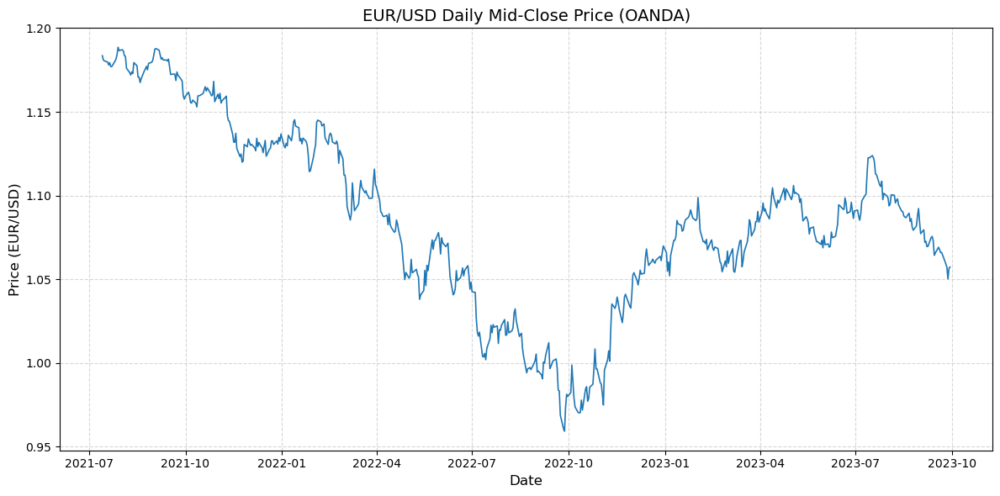
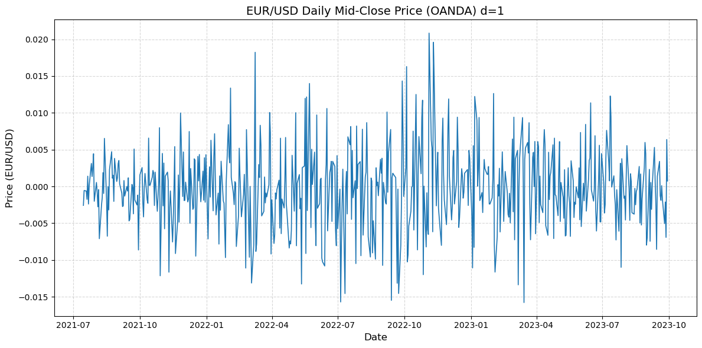
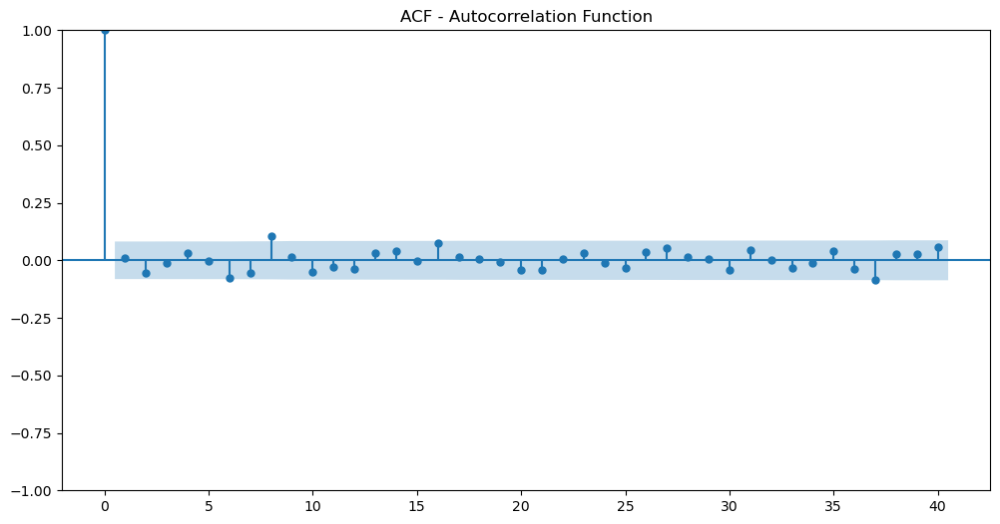
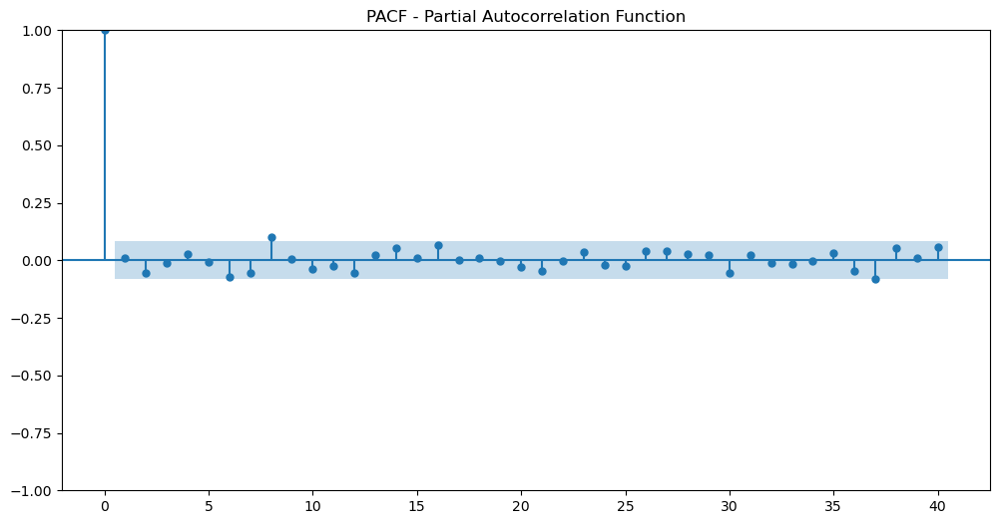
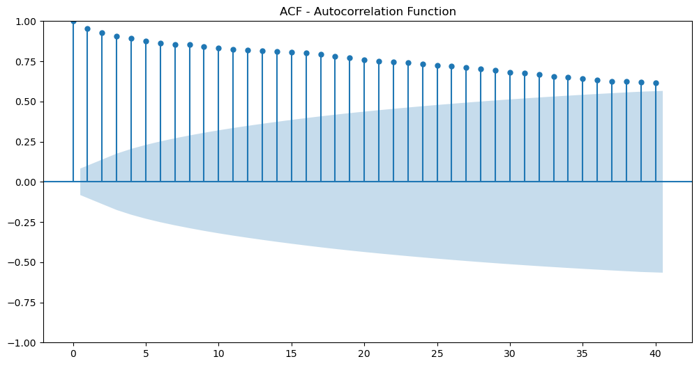
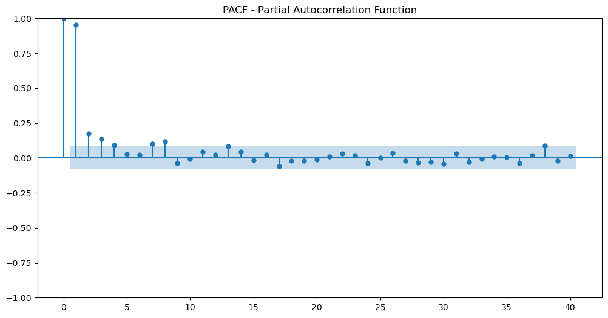
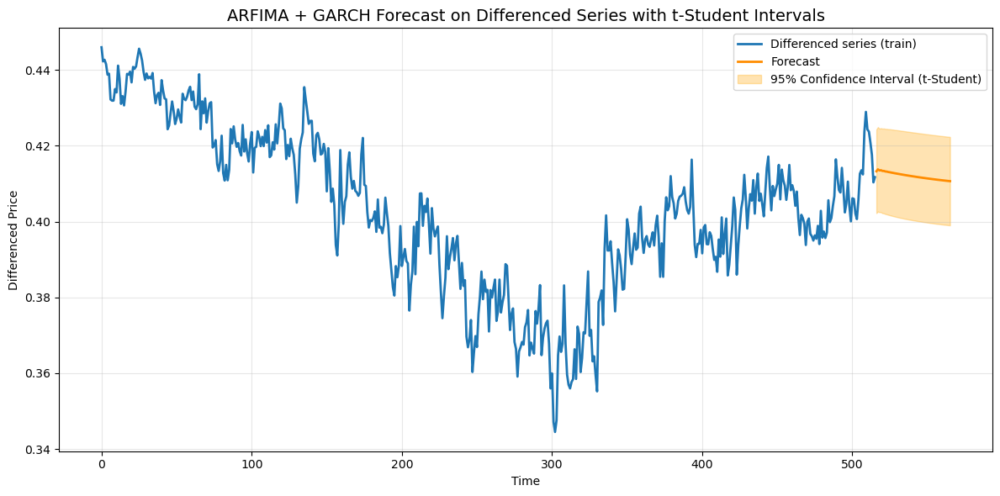
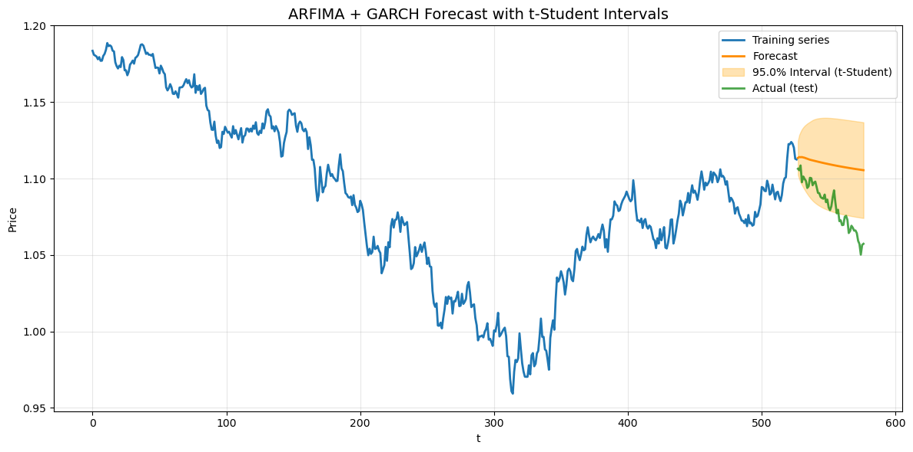

# EUR/USD Forecasting with ARIMA and Extensions

## Introduction

Using ARIMA and its extensions (GARCH, t-Student residuals, and fractional differencing), this paper aims to model and predict the EUR/USD currency pair. Though it is a basic statistical model, ARIMA is vital to take into account as more sophisticated models need to be justified. Beginning with deep learning models makes no sense if easier techniques perform as well or better.

Modeling financial data is not simple; some changes are needed to verify the model and generate accurate predictive performance, hence we will show.

## Dataset

The dataset used in this project consists of daily EUR/USD prices obtained directly from the OANDA API. The data corresponds to the **mid-close price** of each trading day (“B” price: bid/ask midpoint), which is commonly used in academic and quantitative finance research to avoid spread distortions.

* **Instrument:** EUR/USD
* **Source:** OANDA REST API
* **Fields used:** Close price
* **Granularity:** Daily (D)
* **Period:** From 2021-07-14 to 2023-09-29
* **Number of observations:** 577
* **Training observations:** 527
* **Test observations:** 50

**Exploratory Analysis**

We can plot the series to get a visual understanding of its behavior.

Based on the ADF test, we can't reject H0 (the series is non-stationary) since its p-value is 0.3609. Thus, we must difference the series to make it stationary. We will use d=1.

If we differenciate the series (d=1), we can assume that the serie is stationary with a p-value of 0.0000.

This is the differenced series.

Next, we examine the correlations and partial correlations of the series.

These plots suggest that there is no correlation between variables, indicating that the series behaves like white noise and that past values do not help predict future values.

But how is this possible? Does this mean that in financial data there are no linear dependencies between observations?

The short answer is no, there is a limitation in our approach.

## Fractional Differentiation for Stationarity

One way to solve this is to use fractional differentiation, which lets the differencing order $d$ assume non-integer values. Choosing an ideal $d$—defined as the lowest value of $d$ for which the null hypothesis of a unit root in the Augmented Dickey-Fuller (ADF) test can be rejected—allows one to reach stationarity while maintaining a good measure of memory from the original series.

Fractional differentiation extends the traditional differencing used in time series analysis. It lets $d$ assume real values rather than demanding that the differencing order $d$ be an integer.

One approach to overcome this constraint is fractional differentiation, which lets the differencing order $d$ have non-integer values. Choosing an ideal $d$—that is, the lowest value of $d$ for which the null hypothesis of a unit root in the Augmented Dickey-Fuller (ADF) test can be rejected—one can obtain stationarity while retaining a high level of memory from the original sequence.

Fractional differentiation builds on the conventional differencing used in time series analysis. It lets $d$ take real values instead of asking the differencing order $d$ to be an integer.

The backshift operator $B$ is defined as:

$$
B^k X_t = X_{t-k}
$$

With integer $d$, the differencing operator is:

$$
(1 - B)^d X_t = X_t - X_{t-1}, \quad \text{for } d = 1
$$

and for higher integers, the expansion follows the binomial theorem.

For fractional values of $d$, we obtain the binomial series expansion:

$$
(1 - B)^d = \sum_{k=0}^{\infty} \binom{d}{k} (-B)^k
$$

Applied to the time series $X_t$, this becomes:

$$
\tilde{X}_t = \sum_{k=0}^{\infty} \omega_k X_{t-k}
$$

with weights given by:

$$
\omega_k = (-1)^k \, \frac{\prod_{i=0}^{k-1} (d - i)}{k!}
$$

or equivalently:

$$
(1 - B)^d = 1 - dB + \frac{d(d-1)}{2!} B^2 - \frac{d(d-1)(d-2)}{3!} B^3 + \dots
$$

Fractional differentiation preserves long memory because past observations are not fully discarded,but instead receive decreasing weights.

For $0 < d < 1$, past values $X_{t-k}$ still influence the present, but with progressively smaller weights.

This property makes fractional differentiation particularly useful in finance, as it helps reduce non-stationarity while still retaining important long memory in the data.

### Implementation

The process begins by computing the **fractional differentiation weights**, which are derived from the binomial expansion of the backshift operator:

$$
(1-B)^d
$$

To cut very tiny weights, a threshold is used; it balances the accuracy against the quantity of valid points in the resulting series. Lower thresholds keep more weights and preserve more memory, but decrease the amount of genuine observations available for study. Higher thresholds lengthen the series at the expense of somewhat less accurate differencing.

Once the weights are found, fractional differencing of the sequence follows. This entails using the calculated weights to sliding windows of historical observations to produce a stationary value for every point in time. The series that results preserves long-term dependencies proportional to the chosen order $d$.

An optimum weight reduction threshold is chosen using a bisection approach. This approach repeatedly modifies the threshold to guarantee that the fractionally differenced series still has a target ratio of the original observations. This method therefore achieves a balance between **accuracy** and **series length**, thus preventing unnecessary data loss while preserving the sharp contrast.

The Augmented Dickey-Fuller (ADF) test is applied to every candidate series to find the best fractional differencing order $d$. Choosing the smallest $d$ for which the null hypothesis of a unit root may be rejected guarantees stationarity while still preserving memory. Though the step size can be modified depending on the required accuracy, this iterative search examines $d$ values between 0 and 1 in fixed increments.

At last, the framework enables reconstruction of the original series from the fractionally differenced series should it be required, utilizing the same weights backwards. This makes it easier to compare the original price series with the stationary series used for modeling.

To summarize, this application of fractional differentiation gives a strong way of preprocessing financial time series: it guarantees a sufficient number of valid observations for later modeling with ARIMA or its extensions, achieves stationarity, and retains long-term memory.

### Results

We can apply fractional differentiation to our data to evaluate whether it improves the correlations between observations. The optimal fractional differencing order is $d$ = 0.3, with a theshold of 0.01.

This is the differenced series.

**PACF:** There are 3 or 4 significant lags (correlation > 0.1), suggesting that the first 3–4 lags have a direct effect on the series.

**ACF:** It starts at 1 and decreases gradually without abrupt changes, indicating a smooth decay typical of an autoregressive (AR) process.

It is evident that fractional differentiation is more suitable here, which aligns with its typical use in financial data analysis.

## Model selection

### ARIMA

The model is defined as follows:

$$
(1 - a_1 B - a_2 B^2 - \dots - a_p B^p)(1 - B)^d X_t 
= (1 + b_1 B + b_2 B^2 + \dots + b_q B^q)\,\varepsilon_t
$$

$$
d \in \mathbb{N}, 
\qquad 
\varepsilon_t \sim \mathcal{N}(0, \sigma^2) \ \text{i.i.d.}
$$

As discussed earlier, a classical ARIMA model is not the most suitable option for our data, since achieving stationarity requires a differencing order
$d = 0.3$, which is **not an integer**.

For this reason, instead of evaluating standard ARIMA $(p, d, q)$ specifications, we consider the **ARFIMA (AutoRegressive Fractionally Integrated Moving Average)** model, expressed as:

$$
\text{ARFIMA}(p,\, 0.3,\, q)
$$

This model generalizes ARIMA by allowing the integration order $d$ to take fractional values.

### ARFIMA

Here is the definition of the model:

$$
(1 - a_1 B - a_2 B^2 - \dots - a_p B^p)(1 - B)^d X_t 
= (1 + b_1 B + b_2 B^2 + \dots + b_q B^q)\,\varepsilon_t
$$

with

$$
d \in \mathbb{R}, 
\qquad 
\varepsilon_t \sim \mathcal{N}(0, \sigma^2) \ \text{i.i.d.}
$$

First of all, we need to determine the best parameters $(p, q)$ for this stochastic process. Our decision will be based on the **Akaike Information Criterion (AIC)**.

The selected model is an ARIMA process with parameters $p=2$, $d=0.3$, $q=3$. $AIC=-4243.774$

So far, we know the parameters of the model, but we have to validate it in order to make reliable forecasts.

#### Validation

##### Ljung–Box Test (Residual Independence)

**Hypotheses:**

$$
\begin{cases}
H_0: & \text{The residuals are independent (no autocorrelation up to lag } h). \\
H_1: & \text{The residuals exhibit autocorrelation.}
\end{cases}
$$

**Interpretation:**
With $p\text{-value} = 0.0816 > 0.05$, we **do not reject $H_0$**. The residuals are consistent with independence.

##### ARCH Test (Residual Homoscedasticity)

**Hypotheses:**

$$
\begin{cases}
H_0: & \text{The residuals are homoscedastic (constant variance).} \\
H_1: & \text{The residuals exhibit conditional heteroscedasticity (ARCH effects).}
\end{cases}
$$

**Interpretation:**
With $p\text{-value} = 0.0001 < 0.05$, we **reject $H_0$**. The residuals exhibit heteroscedasticity.

##### Shapiro–Wilk Test (Residual Normality)

**Hypotheses:**

$$
\begin{cases}
H_0: & \text{The residuals are normally distributed.} \\
H_1: & \text{The residuals are not normally distributed.}
\end{cases}
$$

**Interpretation:**
With $p\text{-value} = 0.0000 < 0.05$, we reject $H_0$. The residuals are not normally distributed.

Based on the findings, we have two challenges. First, they do not have a normal distribution; second, they are not homoscedastic. As financial time series frequently shows intervals of serenity and bursts of sudden shifts, the assumption of normally distributed residuals is unrealistic; thus, these issues are very prevalent in them.

Since the residuals show non-constant variance, we might think about creating another model to estimate the conditional variance of the series.

### ARFIMA + GARCH

Autoregressive Conditional Heteroscedasticity (ARCH) is the condition in a time series whereby the variance of the error term or innovation is not constant but rather depends on the magnitudes of the errors from prior time periods. The conditional variance at time $t$ is directly connected to the squared innovations of earlier periods.

Financial time series that display volatility clustering—that is, intervals of high fluctuations interspersed with phases of relative stillness—that's what ARCH models are most often used for. Though occasionally grouped among the more general stochastic volatility model family, ARCH-type models are strictly deterministic in that the conditional variance is totally dictated by historical values.

A generalized ARCH model (GARCH) extends ARCH by also including past conditional variances in the model, allowing for a more flexible structure. A generic GARCH$(q,p)$ model is defined as:

$$
\sigma_t^2 = \alpha_0 + \sum_{i=1}^{p} \alpha_i \, \varepsilon_{t-i}^2 + \sum_{j=1}^{q} \beta_j \, \sigma_{t-j}^2,
\qquad \alpha_0, \alpha_i, \beta_j > 0
$$

where:

- $\varepsilon_t$ are the residuals of the ARFIMA we have defined (in this case)
- $\sigma_t^2$ is the conditional variance at time $t$
- $p$ = order of the ARCH component
- $q$ = order of the GARCH component

The residuals $\varepsilon_t$ represent the unpredictable part of the series, defined as:

$$
\varepsilon_t = y_t - \hat{y}_t
$$

where:

- $y_t$ = observed value at time $t$
- $\hat{y}_t$ = predicted value from the ARFIMA (in this case)

The residuals are modeled as:

$$
\varepsilon_t = \sigma_t z_t, \quad z_t \sim \mathcal{N}(0,1) \ \text{i.i.d.}
$$

So, the final prediction is:

$$
y_t = \hat{y}_t + \varepsilon_t = \hat{y}_t + \sigma_t z_t
$$

Having this clear, what we have to evaluate now is whether the standardized residuals

$$
z_t = \frac{\varepsilon_t}{\sigma_t}
$$

are homoscedastic and follow a normal distribution.

If we apply the ARCH test again (to $z_t$), the result is:

$p\text{-value} = 0.5424 > 0.05$, we **do not reject $H_0$**. The residuals exhibit homocedasticity.

The last thing to check is whether the residuals are normally distributed.

Shapiro test:

$p\text{-value} = 0.0668 > 0.05$, we **do not reject $H_0$**. The residuals exhibit normality.

We do not reject, but just barely. In the world of finance, finding normality in residuals is quite a challenge; they often have heavy tails, making the assumption of normality pretty unrealistic.

If another test is used:

D'Agostino-Pearson normality test:

$p\text{-value} = 0.0335 < 0.05$, we **reject $H_0$**. The residuals do not exhibit normality.

In general, we can not expect the residuals to follow a normal distribution. For this reason, we could use a t-distribution, which provides more flexibility and allows us to obtain a configuration that fits the data more accurately.

### ARFIMA + GARCH (t-distribution)

Up until now, we've been sticking with the normal distribution for the sake of simplicity. But as we've noticed, this often doesn't reflect the reality of financial data.

The **Student’s t-distribution** is an extension of the normal distribution that takes into account heavier tails. This makes it especially valuable in finance, as it allows for a greater likelihood of extreme values in the residuals, which is crucial for capturing the heavy-tailed behavior we frequently see in asset returns. By incorporating a t-distribution into the GARCH model, we can more accurately represent the volatility and tail risk present in financial time series.

Before we dive into the Kolmogorov–Smirnov test to determine if the standardized residuals align with a Student’s t-distribution, we first need to **estimate the parameters of the t-distribution** (degrees of freedom, location, and scale) based on the residuals. These parameters will define the specific t-distribution we'll use in the test. For simplicity's sake, we set the location to zero.

**Kolmogorov–Smirnov Test (Residuals vs. Student’s t-Distribution):**

**Hypotheses:**

$$
\begin{cases}
H_0: & \text{The standardized residuals follow a Student's t-distribution.} \\
H_1: & \text{The standardized residuals do not follow a Student's t-distribution.}
\end{cases}
$$

**Interpretation:**
With $p\text{-value} = 0.8757 > 0.05$, we **do not reject $H_0$**. The standardized residuals are consistent with a Student's t-distribution.

At this point, we have validated the model, it exhibits independence (also for the standardized residuals), homocedasticity (with GARCH) and follows the assumed distribution (t-distribution).

## Forecasting and Model Evaluation

So, this is the formal definition of the model:

**ARFIMA(p, d, q) with intercept:**

$$
Y_t = \mu + \sum_{i=1}^{p} \phi_i Y_{t-i} + \sum_{j=1}^{q} \theta_j \varepsilon_{t-j} + \varepsilon_t
$$

**GARCH(p, q) for conditional variance:**

$$
\sigma_t^2 = \alpha_0 + \sum_{i=1}^{p} \alpha_i \, \varepsilon_{t-i}^2 + \sum_{j=1}^{q} \beta_j \, \sigma_{t-j}^2,
\qquad \alpha_0, \alpha_i, \beta_j > 0
$$

**Residuals:**

$$
\varepsilon_t = \sigma_t z_t, \quad z_t \sim t_\nu \ \text{i.i.d.}
$$

**Where:**

- $Y_t, \ t = 1, \dots, n$ is the **fractionally differenced series**.
- $\mu$ is the constant of the ARFIMA model.
- $\phi_1, \dots, \phi_p$ are the **autoregressive (AR) coefficients**.
- $\theta_1, \dots, \theta_q$ are the **moving average (MA) coefficients**.
- $\varepsilon_t$ are the **residuals** from the ARFIMA model.
- $\sigma_t^2$ is the **conditional variance** of $\varepsilon_t$ at time $t$ (modeled by GARCH).
- $\alpha_0, \alpha_1, \dots, \alpha_p$ and $\beta_1, \dots, \beta_q$ are the **GARCH parameters**, all positive.
- $t_\nu$ denotes the **Student's t-distribution** with $\nu$ degrees of freedom, representing the standardized shocks.

### Forecasting

This is the plot of the predictions of the model for the test set.

We must apply the inverse of the differenciation to get a forecast in the real scale.

Once we obtain the predicted values, we need to evaluate the performance of the model.

### Model evaluation

As our model is designed for regression, we must evaluate standard performance metrics such as RMSE, MSE, and MAE, and compare them against appropriate baseline models. In our case, we will use two baselines:

**Naïve model**:

$$
\widehat{Y}_t = Y_{t-1}
$$

which assumes that the next value will be equal to the previous one.

**Median model**, which predicts the median of the training set for all future observations.

Results:

| Model                     | MSE    | RMSE   | MAE    |
| ------------------------- | ------ | ------ | ------ |
| **ARFIMA + GARCH**  | 0.0009 | 0.0300 | 0.0273 |
| **Naïve baseline** | 0.0009 | 0.0293 | 0.0242 |
| **Median baseline** | 0.0002 | 0.0153 | 0.0129 |

The ARFIMA–GARCH model does not outperform the naïve benchmark, which actually manages to achieve slightly lower RMSE and MAE. This points to the series showing a strong tendency for short-term persistence, meaning that the previous value is a pretty reliable predictor for the next one. While the difference between the two models is minimal, the naïve model consistently edges out the competition across all metrics.

What's even more noteworthy is that the median model clearly takes the lead, boasting significantly lower error values. This suggests that the series might be quite close to stationary around a central value during the forecast period, or perhaps the short-term forecast horizon (50 steps) just doesn't bring enough trend or volatility dynamics for the ARFIMA–GARCH model to really shine.

So, does this mean that everything we have done is useless?

Conclusion

First, notice that this is a concrete example within the world of financial time series, and we can not make general conclusions. Having said that, this approach obviously has limitations since the model is really simple and only takes into account linear patterns.

While it might seem like statistical models have no place in finance, that's far from the truth. In fact, their biggest strength is that they are **white-box models**, which means you can fully understand their structure and parameters. This clarity helps bridge the gap between economic or financial concepts and how the model actually behaves.

Consider the AR, MA, and ARFIMA components; they can be viewed through the lens of persistence, memory, or mean-reversion in returns. On the other hand, GARCH parameters are closely linked to ideas like volatility clustering, leverage effects, or risk dynamics. This kind of clarity allows practitioners to understand *why* a model behaves the way it does, extract meaningful economic insights, and evaluate whether the underlying assumptions are valid.

On the other hand, there are other ways to apply these types of models to financial markets, since price forecasting is an extremely difficult task. Although predicting prices is usually the first approach one attempts in order to be profitable, there are alternative applications.

One effective way to tackle this issue is by leveraging the cointegration among various securities. To put it simply, this means creating a new series by combining two or more time series in a linear way. Because the original series are cointegrated, this new combination usually ends up being stationary, even if the individual series aren’t.

This method is more logical because the core idea is that the series should be stationary, rather than just relying on differencing. Differencing has its drawbacks: when we apply integer differences, the series loses all its historical context, and the correlation between the variables gets wiped out. On the flip side, if we opt for fractional differencing, we can get a series that seems stationary, but there’s no assurance that it will revert to the mean over the forecast period, which is a key assumption in ARIMA models.

In `arfima_garch.py` we have the implementation of the model we have proposed.

The function `fit_model` is designed to fit an **ARFIMA + GARCH model** to a financial time series (typically a price series). Its goal is to:

1. Make the series **stationary** using **fractional differentiation**.
2. Fit an **ARIMA model** to the stationary series.
3. Check for **ARCH effects** in the residuals.
4. If ARCH is present, fit a **GARCH model with Student-t innovations**.
5. Validate the residuals of the model using statistical tests (**Ljung-Box**, **ARCH test**, and **Kolmogorov–Smirnov** for t-distribution).
6. Return the fitted models, **fractional differentiation parameters**, and **Student-t parameters**.

## References

1. Brownlee, Jason. *Deep Learning for Time Series Forecasting: Predict the Future with MLPs, CNNs and LSTMs in Python*. Machine Learning Mastery, 2018.
2. López de Prado, Marcos. *Advances in Financial Machine Learning*. Wiley, 2018.
3. Wikipedia contributors. "Autoregressive conditional heteroskedasticity." *Wikipedia*, The Free Encyclopedia. [https://en.wikipedia.org/wiki/Autoregressive_conditional_heteroskedasticity](https://en.wikipedia.org/wiki/Autoregressive_conditional_heteroskedasticity)
4. Wikipedia contributors. "Student's t-distribution." *Wikipedia*, The Free Encyclopedia. [https://en.wikipedia.org/wiki/Student%27s_t-distribution](https://en.wikipedia.org/wiki/Student%27s_t-distribution)
